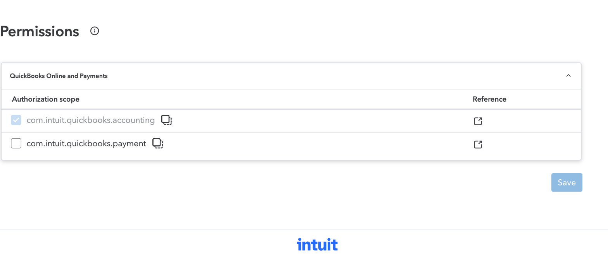
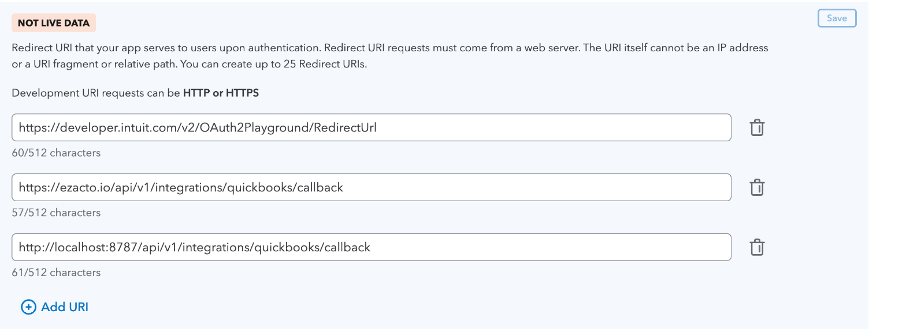
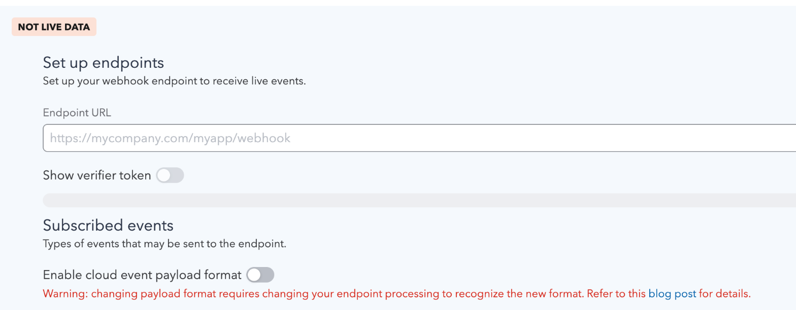

# Connecting ezacto to QuickBooks Online

What an operator has to do at Intuit before the **Connect to QuickBooks** button
can work, and why each step exists. Written from doing it, not from the API docs.

The short version: **the callback URL has to be registered at Intuit first.**
OAuth will not redirect anywhere it has not been told about in advance, so a
deployment whose callback is not on the list gets an Intuit error page instead of
a connected company, and nothing in ezacto's logs explains it.

Everything below is per *app*, and an app belongs to a workspace on
[developer.intuit.com](https://developer.intuit.com). You need two of them
eventually — one for development against a sandbox company, one for production —
because Intuit issues a separate pair of keys per environment and a sandbox key
cannot reach a real company's books.

---

## 1. Create the app

**My Hub → App dashboard → your workspace → Apps → +**, then give it a name.

The name is what an operator sees on Intuit's consent screen when they connect,
so it should be the product name rather than an internal one.

## 2. Ask for the accounting scope, and only that



`com.intuit.quickbooks.accounting` covers customers, invoices and the payments
recorded against them — both directions of the mirror.

**`com.intuit.quickbooks.payment` is not needed and should not be requested.**
It is the card-processing API: taking a payment ourselves, rather than reading
one QuickBooks already took. Asking for it "in case" means asking every operator
to grant card processing to an app that does not process cards, and Intuit shows
them exactly that on the consent screen.

Making a mirrored invoice *payable* does not need it either — that is
`AllowOnlineACHPayment` on the invoice, which rides on the accounting scope and
on the company's own QuickBooks Payments account.

> Intuit warns that permissions cannot be removed once added. They can be added
> later, so start narrow.

## 3. Register the callback URL

**Settings → Redirect URIs.** This is the step that is easy to miss and
impossible to work around.



Add one per deployment that will connect:

```
https://<your-host>/api/v1/integrations/quickbooks/callback
```

For local work, the development environment accepts plain HTTP, so
`http://localhost:8787/api/v1/integrations/quickbooks/callback` is valid. The
production environment does not — it must be HTTPS.

Intuit's own OAuth Playground URL is pre-filled and worth keeping: it is how you
test a token exchange without running ezacto at all.

### Two traps here, both of which cost me time

**The Save button is off-screen on a narrow window.** The panel's Save sits at
its top right, outside the viewport below roughly 1400px wide. Everything looks
editable, entries appear to take, and navigating away silently discards them —
there is no warning. If you do not see the toast reading *"Changes saved here and
in your settings"*, it did not save. Widen the window until Save is visible.

**Saving is per panel.** Each tab under Settings saves independently.

## 4. Webhooks, for payments coming back

**Webhooks → Development / Production.**



Three things matter:

| | |
| --- | --- |
| **Endpoint URL** | `https://<your-host>/api/v1/integrations/quickbooks/webhook`. Must be publicly reachable HTTPS — Intuit will not deliver to localhost. For local work, use a tunnel. |
| **Verifier token** | Revealed by the toggle. Intuit signs every delivery with it (HMAC-SHA256, `intuit-signature` header), and the endpoint **must** verify that signature — the URL is public, and anything that reaches it is otherwise unauthenticated. |
| **Subscribed events** | Every entity is checked by default. Narrow it to **Invoice** and **Payment**; everything else is delivery volume for events that will be ignored. |

Leave *"Enable cloud event payload format"* off unless the endpoint has been
written for it — the warning on that toggle is accurate, and the two formats are
not interchangeable.

Configure the endpoint **after** it is deployed. Intuit begins delivering as soon
as it is saved, and deliveries to a URL that 404s are retried and then dropped.

## 5. Keys

**Keys and credentials**, per environment. The client ID and secret are revealed
by a toggle.

The secret is a credential: it belongs in the deployment's secret store, never in
the repository, never in a URL. ezacto sends it as HTTP Basic authorization on
the token exchange, which is where Intuit expects it.

Development keys reach sandbox companies only. Production keys require going
through Intuit's app assessment first, which is a separate process with its own
review — worth starting before you need it rather than on the day you do.

---

## What ezacto does with all of this

1. An administrator opens **Settings → Integrations** and presses **Connect to
   QuickBooks**.
2. ezacto redirects to Intuit with the client ID, the accounting scope, the
   registered callback, and a single-use `state`.
3. The operator picks a company and approves.
4. Intuit redirects back to the callback with a code, the `realmId` of the
   company they chose, and the `state` — which is checked before anything else
   happens. A callback whose state does not match is refused: without that check,
   a third party can walk an administrator through connecting *their* QuickBooks
   company to your instance.
5. ezacto exchanges the code for tokens and stores them against that realm.

From then on invoices mirror out, and payments recorded in QuickBooks come back
over the webhook.

## Sandbox companies

**My Hub → Sandboxes** gives you a QuickBooks company with fake data to connect
against. A development-key connection can only reach these, which is the safety
property that makes it reasonable to test the mirror at all: a bug writes an
invoice into a sandbox rather than into somebody's books.
